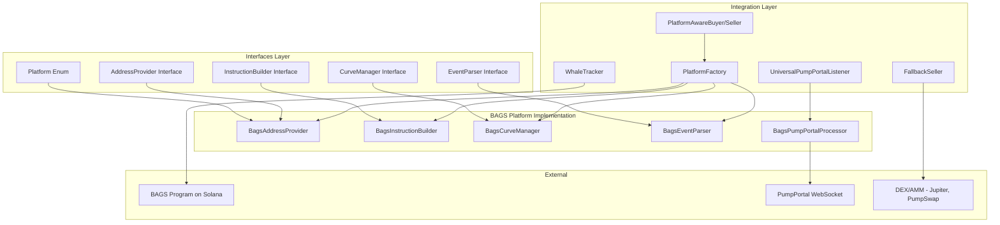
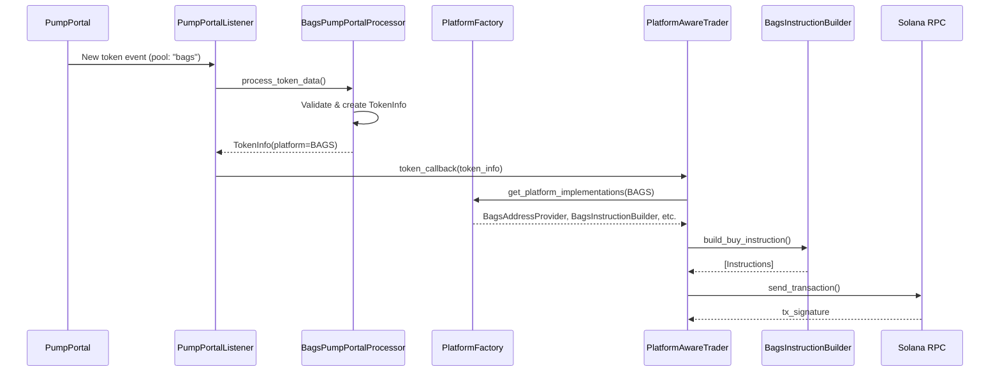

# Дизайн-документ: Поддержка платформы BAGS

## Обзор

Данный документ описывает техническую реализацию поддержки платформы BAGS в существующем Solana торговом боте. BAGS — это платформа для создания и торговли токенами на Solana с Program ID: `HWPsB1A5biibMngZB8XXb7FnFT4ohm1DMY6y1JdLBAGS`. Токены BAGS идентифицируются по окончанию адреса на "bags".

Реализация следует существующей архитектуре платформ (pump.fun, letsbonk) и включает:
- Полную реализацию интерфейсов платформы (AddressProvider, InstructionBuilder, CurveManager, EventParser)
- Интеграцию с системами мониторинга (WhaleTracker, PumpPortalListener)
- Поддержку торговли через bonding curve и DEX/AMM после миграции
- Все стратегии продажи (TP, SL, Trailing Stop)

## Архитектура

### Диаграмма компонентов



### Поток данных



## Компоненты и интерфейсы

### 1. Расширение Platform Enum

```python
# src/interfaces/core.py
class Platform(Enum):
    """Supported trading platforms."""
    PUMP_FUN = "pump_fun"
    LETS_BONK = "lets_bonk"
    BAGS = "bags"  # NEW
```

### 2. BagsAddresses - Константы адресов

```python
# src/platforms/bags/address_provider.py
@dataclass
class BagsAddresses:
    """BAGS program addresses."""
    
    PROGRAM: Final[Pubkey] = Pubkey.from_string(
        "HWPsB1A5biibMngZB8XXb7FnFT4ohm1DMY6y1JdLBAGS"
    )
    # Дополнительные адреса будут определены после анализа on-chain программы:
    # - GLOBAL_CONFIG: глобальная конфигурация
    # - FEE_RECIPIENT: получатель комиссий
    # - EVENT_AUTHORITY: авторитет для событий
```

### 3. BagsAddressProvider

```python
# src/platforms/bags/address_provider.py
class BagsAddressProvider(AddressProvider):
    """BAGS implementation of AddressProvider interface."""

    @property
    def platform(self) -> Platform:
        return Platform.BAGS

    @property
    def program_id(self) -> Pubkey:
        return BagsAddresses.PROGRAM

    def derive_pool_address(self, base_mint: Pubkey, quote_mint: Pubkey | None = None) -> Pubkey:
        """Derive pool/bonding curve PDA for BAGS token."""
        # PDA derivation based on BAGS program structure
        pass

    def derive_user_token_account(self, user: Pubkey, mint: Pubkey, 
                                   token_program_id: Pubkey | None = None) -> Pubkey:
        """Derive user's ATA for BAGS token."""
        pass

    def get_additional_accounts(self, token_info: TokenInfo) -> dict[str, Pubkey]:
        """Get BAGS-specific accounts for trading."""
        pass

    def get_buy_instruction_accounts(self, token_info: TokenInfo, user: Pubkey) -> dict[str, Pubkey]:
        """Get all accounts needed for buy instruction."""
        pass

    def get_sell_instruction_accounts(self, token_info: TokenInfo, user: Pubkey) -> dict[str, Pubkey]:
        """Get all accounts needed for sell instruction."""
        pass
```

### 4. BagsInstructionBuilder

```python
# src/platforms/bags/instruction_builder.py
class BagsInstructionBuilder(InstructionBuilder):
    """BAGS implementation of InstructionBuilder interface."""

    def __init__(self, idl_parser: IDLParser | None = None):
        """Initialize with optional IDL parser."""
        self._idl_parser = idl_parser
        if idl_parser:
            discriminators = idl_parser.get_instruction_discriminators()
            self._buy_discriminator = discriminators.get("buy")
            self._sell_discriminator = discriminators.get("sell")

    async def build_buy_instruction(
        self, token_info: TokenInfo, user: Pubkey,
        amount_in: int, minimum_amount_out: int,
        address_provider: AddressProvider
    ) -> list[Instruction]:
        """Build buy instructions for BAGS."""
        pass

    async def build_sell_instruction(
        self, token_info: TokenInfo, user: Pubkey,
        amount_in: int, minimum_amount_out: int,
        address_provider: AddressProvider
    ) -> list[Instruction]:
        """Build sell instructions for BAGS."""
        pass

    def get_buy_compute_unit_limit(self, config_override: int | None = None) -> int:
        return config_override or 100_000

    def get_sell_compute_unit_limit(self, config_override: int | None = None) -> int:
        return config_override or 60_000
```

### 5. BagsCurveManager

```python
# src/platforms/bags/curve_manager.py
class BagsCurveManager(CurveManager):
    """BAGS implementation of CurveManager interface."""

    def __init__(self, client: SolanaClient, idl_parser: IDLParser | None = None):
        self.client = client
        self._idl_parser = idl_parser

    async def get_pool_state(self, pool_address: Pubkey) -> dict[str, Any]:
        """Get current BAGS pool/bonding curve state."""
        pass

    async def calculate_price(self, pool_address: Pubkey) -> float:
        """Calculate current token price in SOL."""
        pass

    async def calculate_buy_amount_out(self, pool_address: Pubkey, amount_in: int) -> int:
        """Calculate expected tokens for given SOL input."""
        pass

    async def calculate_sell_amount_out(self, pool_address: Pubkey, amount_in: int) -> int:
        """Calculate expected SOL for given token input."""
        pass

    async def get_reserves(self, pool_address: Pubkey) -> tuple[int, int]:
        """Get (token_reserves, sol_reserves)."""
        pass
```

### 6. BagsEventParser

```python
# src/platforms/bags/event_parser.py
class BagsEventParser(EventParser):
    """BAGS implementation of EventParser interface."""

    def __init__(self, idl_parser: IDLParser | None = None):
        self._idl_parser = idl_parser
        if idl_parser:
            self._create_event_discriminator = idl_parser.get_event_discriminators().get("CreateEvent")
            self._create_instruction_discriminator = idl_parser.get_instruction_discriminators().get("create")

    def parse_token_creation_from_logs(self, logs: list[str], signature: str) -> TokenInfo | None:
        """Parse BAGS token creation from transaction logs."""
        pass

    def parse_token_creation_from_instruction(
        self, instruction_data: bytes, accounts: list[int], account_keys: list[bytes]
    ) -> TokenInfo | None:
        """Parse BAGS token creation from instruction data."""
        pass

    def parse_token_creation_from_geyser(self, transaction_info: Any) -> TokenInfo | None:
        """Parse from Geyser transaction data."""
        pass

    def parse_token_creation_from_block(self, block_data: dict[str, Any]) -> TokenInfo | None:
        """Parse from block data."""
        pass

    def get_program_id(self) -> Pubkey:
        return BagsAddresses.PROGRAM

    def get_instruction_discriminators(self) -> list[bytes]:
        return [self._create_instruction_discriminator] if self._create_instruction_discriminator else []
```

### 7. BagsPumpPortalProcessor

```python
# src/platforms/bags/pumpportal_processor.py
class BagsPumpPortalProcessor:
    """PumpPortal processor for BAGS tokens."""

    def __init__(self):
        self.address_provider = BagsAddressProvider()

    @property
    def platform(self) -> Platform:
        return Platform.BAGS

    @property
    def supported_pool_names(self) -> list[str]:
        return ["bags"]  # PumpPortal pool name for BAGS

    def can_process(self, token_data: dict) -> bool:
        """Check if data is from BAGS platform."""
        pool = token_data.get("pool", "").lower()
        return pool in self.supported_pool_names

    def process_token_data(self, token_data: dict) -> TokenInfo | None:
        """Process BAGS token data from PumpPortal."""
        pass
```

## Модели данных

### TokenInfo расширение

Существующая структура `TokenInfo` уже поддерживает необходимые поля. Для BAGS будут использоваться:

```python
@dataclass
class TokenInfo:
    # Core fields
    name: str
    symbol: str
    uri: str
    mint: Pubkey
    platform: Platform  # Platform.BAGS

    # BAGS-specific fields (аналогично pump.fun)
    bonding_curve: Pubkey | None = None
    associated_bonding_curve: Pubkey | None = None
    
    # Или аналогично letsbonk
    pool_state: Pubkey | None = None
    base_vault: Pubkey | None = None
    quote_vault: Pubkey | None = None

    # Common fields
    user: Pubkey | None = None
    creator: Pubkey | None = None
    creator_vault: Pubkey | None = None
    token_program_id: Pubkey | None = None
    creation_timestamp: float | None = None
```

### Идентификация BAGS токенов

```python
def is_bags_token(mint_address: str) -> bool:
    """Check if token is BAGS by address suffix."""
    return mint_address.lower().endswith("bags")
```

## Свойства корректности

*Свойство корректности — это характеристика или поведение, которое должно выполняться для всех допустимых входных данных системы. Свойства служат мостом между человекочитаемыми спецификациями и машинно-проверяемыми гарантиями корректности.*


### Property 1: Platform Routing Consistency

*For any* TokenInfo with platform=Platform.BAGS, the system shall route all operations to BAGS-specific implementations (BagsAddressProvider, BagsInstructionBuilder, BagsCurveManager, BagsEventParser).

**Validates: Requirements 1.2, 10.1, 10.2, 12.2, 16.3**

### Property 2: Pool Address Derivation Determinism

*For any* valid base_mint Pubkey, calling derive_pool_address on BagsAddressProvider shall return a consistent, valid Pubkey that is deterministically derived.

**Validates: Requirements 2.3**

### Property 3: User Token Account Derivation Determinism

*For any* valid user Pubkey and mint Pubkey, calling derive_user_token_account on BagsAddressProvider shall return a consistent, valid associated token account address.

**Validates: Requirements 2.4**

### Property 4: Additional Accounts Completeness

*For any* valid TokenInfo with platform=BAGS, calling get_additional_accounts shall return a dictionary containing all required platform-specific account keys.

**Validates: Requirements 2.5**

### Property 5: Buy Instruction Validity

*For any* valid TokenInfo with platform=BAGS, user Pubkey, amount_in, and minimum_amount_out, calling build_buy_instruction shall return a non-empty list of valid Solana Instructions.

**Validates: Requirements 3.2**

### Property 6: Sell Instruction Validity

*For any* valid TokenInfo with platform=BAGS, user Pubkey, amount_in, and minimum_amount_out, calling build_sell_instruction shall return a non-empty list of valid Solana Instructions.

**Validates: Requirements 3.3**

### Property 7: Required Accounts for Buy Non-Empty

*For any* valid TokenInfo with platform=BAGS and user Pubkey, calling get_required_accounts_for_buy shall return a non-empty list of valid Pubkeys.

**Validates: Requirements 3.5**

### Property 8: Required Accounts for Sell Non-Empty

*For any* valid TokenInfo with platform=BAGS and user Pubkey, calling get_required_accounts_for_sell shall return a non-empty list of valid Pubkeys.

**Validates: Requirements 3.6**

### Property 9: Price Calculation Positivity

*For any* valid pool state with positive reserves, calculate_price shall return a positive float representing the token price in SOL.

**Validates: Requirements 4.3**

### Property 10: Buy Amount Calculation Consistency

*For any* valid pool state and positive amount_in, calculate_buy_amount_out shall return a non-negative integer following the bonding curve formula.

**Validates: Requirements 4.4**

### Property 11: Sell Amount Calculation Consistency

*For any* valid pool state and positive amount_in, calculate_sell_amount_out shall return a non-negative integer following the bonding curve formula.

**Validates: Requirements 4.5**

### Property 12: Event Parsing Round-Trip

*For any* valid BAGS token creation event, parsing from logs, instruction data, Geyser data, or block data shall produce a TokenInfo with platform=Platform.BAGS and consistent field values.

**Validates: Requirements 5.2, 5.3, 5.4, 5.5**

### Property 13: PumpPortal Processing Correctness

*For any* token data from PumpPortal with pool="bags", can_process shall return True, and process_token_data shall return TokenInfo with platform=Platform.BAGS and correctly mapped fields.

**Validates: Requirements 6.3, 6.4, 6.5**

### Property 14: Whale Tracking Event Emission

*For any* whale buy transaction on BAGS platform, the WhaleTracker shall emit a WhaleBuy event with platform="bags", and when target_platform="bags", only BAGS transactions shall be processed.

**Validates: Requirements 8.2, 8.4, 14.3**

### Property 15: PumpPortal Listener Callback Invocation

*For any* BAGS token detected via PumpPortal (when Platform.BAGS is in platforms list), the listener shall invoke token_callback with TokenInfo having platform=Platform.BAGS.

**Validates: Requirements 9.2, 9.3**

### Property 16: BAGS Token Identification by Address Suffix

*For any* token mint address ending with "bags" (case-insensitive), the system shall identify it as a BAGS platform token.

**Validates: Requirements 13.3, 16.1, 19.5**

### Property 17: Platform Detection by Program ID

*For any* transaction logs containing BAGS program ID (HWPsB1A5biibMngZB8XXb7FnFT4ohm1DMY6y1JdLBAGS), the platform detection logic shall identify the platform as BAGS.

**Validates: Requirements 16.2**

### Property 18: Time-Based Exit Strategy Execution

*For any* BAGS position with exit_strategy="time_based", the system shall execute sell after the configured hold time has elapsed.

**Validates: Requirements 15.6**

### Property 19: TP/SL Exit Strategy Execution

*For any* BAGS position with exit_strategy="tp_sl", the system shall execute sell when price reaches take-profit or stop-loss levels.

**Validates: Requirements 15.7**

### Property 20: Migration Handling Continuity

*For any* BAGS token that migrates from bonding curve to DEX/AMM, the system shall track the address mapping, resubscribe to events with the new address, and use DEX/AMM for subsequent trading operations.

**Validates: Requirements 17.2, 17.4, 18.2, 18.5**

### Property 21: Token Creation Timestamp Logging

*For any* newly detected BAGS token, the system shall log the creation timestamp in the TokenInfo.creation_timestamp field.

**Validates: Requirements 19.4**

## Обработка ошибок

### Стратегия обработки ошибок

1. **Ошибки RPC соединения**
   - Реализовать retry с exponential backoff
   - Использовать fallback RPC endpoints
   - Логировать все ошибки соединения

2. **Ошибки парсинга событий**
   - Возвращать None при невозможности парсинга
   - Логировать детали ошибки для отладки
   - Не прерывать работу listener'а

3. **Ошибки торговых операций**
   - Возвращать TradeResult с success=False и error_message
   - Реализовать retry для временных ошибок
   - Использовать FallbackSeller для мигрированных токенов

4. **Ошибки IDL**
   - Graceful fallback на ручное построение инструкций
   - Логировать предупреждение при отсутствии IDL
   - Продолжать работу без IDL

### Коды ошибок

```python
class BagsError(Exception):
    """Base exception for BAGS platform errors."""
    pass

class BagsPoolNotFoundError(BagsError):
    """Pool/bonding curve not found for token."""
    pass

class BagsInstructionBuildError(BagsError):
    """Failed to build trading instruction."""
    pass

class BagsMigrationError(BagsError):
    """Error during token migration handling."""
    pass
```

## Стратегия тестирования

### Подход к тестированию

Используется двойной подход:
- **Unit тесты**: проверка конкретных примеров, edge cases, условий ошибок
- **Property-based тесты**: проверка универсальных свойств на множестве входных данных

### Unit тесты

1. **BagsAddressProvider**
   - Проверка program_id возвращает корректный адрес
   - Проверка derive_pool_address для известных токенов
   - Проверка get_system_addresses содержит все необходимые адреса

2. **BagsInstructionBuilder**
   - Проверка build_buy_instruction возвращает валидные инструкции
   - Проверка compute unit limits в допустимых пределах
   - Проверка работы с и без IDL

3. **BagsCurveManager**
   - Проверка парсинга pool state
   - Проверка расчёта цены для известных состояний
   - Проверка обработки невалидных данных

4. **BagsEventParser**
   - Проверка парсинга известных событий создания токенов
   - Проверка возврата None для не-BAGS событий
   - Проверка корректности discriminator'ов

5. **BagsPumpPortalProcessor**
   - Проверка can_process для разных pool names
   - Проверка маппинга полей PumpPortal → TokenInfo

### Property-based тесты

Каждое свойство из раздела "Свойства корректности" должно быть реализовано как property-based тест с минимум 100 итерациями.

**Конфигурация тестов:**
- Библиотека: `hypothesis` для Python
- Минимум итераций: 100
- Формат тега: `Feature: bags-platform-support, Property N: {property_text}`

### Примеры property-based тестов

```python
from hypothesis import given, strategies as st

@given(st.binary(min_size=32, max_size=32))
def test_pool_address_derivation_determinism(mint_bytes):
    """Feature: bags-platform-support, Property 2: Pool Address Derivation Determinism"""
    mint = Pubkey.from_bytes(mint_bytes)
    provider = BagsAddressProvider()
    
    result1 = provider.derive_pool_address(mint)
    result2 = provider.derive_pool_address(mint)
    
    assert result1 == result2  # Deterministic
    assert len(str(result1)) == 44  # Valid Solana address

@given(st.text(min_size=1, max_size=32), st.text(min_size=1, max_size=10))
def test_pumpportal_processing_correctness(name, symbol):
    """Feature: bags-platform-support, Property 13: PumpPortal Processing Correctness"""
    processor = BagsPumpPortalProcessor()
    
    token_data = {
        "pool": "bags",
        "name": name,
        "symbol": symbol,
        "mint": "So11111111111111111111111111111111111111112",
        "traderPublicKey": "So11111111111111111111111111111111111111112",
    }
    
    assert processor.can_process(token_data) == True
    
    result = processor.process_token_data(token_data)
    if result:
        assert result.platform == Platform.BAGS
        assert result.name == name
        assert result.symbol == symbol
```

### Интеграционные тесты

1. **End-to-end flow**: PumpPortal → Listener → Trader → Solana
2. **Migration flow**: Bonding curve → DEX/AMM fallback
3. **Whale tracking flow**: WSS → WhaleTracker → Signal

### Тестовые данные

- Использовать devnet для интеграционных тестов
- Создать fixtures с известными BAGS токенами
- Мокировать RPC вызовы для unit тестов
