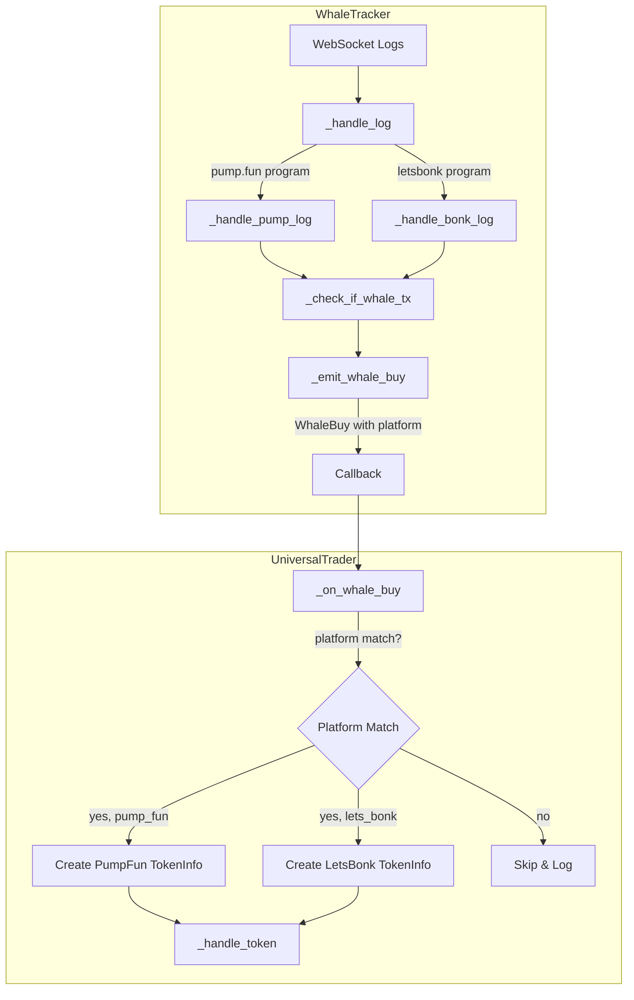

# Design Document: Multi-Platform Whale Copy Trading

## Overview

This design extends the whale copy trading system to support all trading platforms (pump.fun and letsbonk/Raydium LaunchLab). The current implementation detects whale transactions from both platforms but only processes pump.fun trades. This enhancement enables platform-aware whale copy trading where each bot copies trades only from its configured platform.

### Key Changes

1. **Platform Detection**: Modify `WhaleTracker` to detect and propagate platform information from log subscriptions
2. **Platform Routing**: Update `_on_whale_buy()` to route trades based on platform matching
3. **LetsBonk Support**: Add TokenInfo creation logic for letsbonk using `LetsBonkAddressProvider`
4. **Bug Fix**: Fix the missing `_handle_log` method that routes to platform-specific handlers

## Architecture



## Components and Interfaces

### 1. WhaleBuy Dataclass Enhancement

The `WhaleBuy` dataclass already has a `platform` field but it's always set to "pump_fun". We need to set it correctly based on the detected program.

```python
@dataclass
class WhaleBuy:
    """Information about a whale purchase."""
    whale_wallet: str
    token_mint: str
    token_symbol: str
    amount_sol: float
    timestamp: datetime
    tx_signature: str
    whale_label: str = "whale"
    block_time: int | None = None
    age_seconds: float = 0
    platform: str = "pump_fun"  # Now correctly set based on detection
```

### 2. WhaleTracker Modifications

#### New Method: `_handle_log`

Routes incoming logs to the appropriate platform-specific handler based on program ID detection.

```python
async def _handle_log(self, data: dict) -> None:
    """Route log to appropriate platform handler based on program ID.
    
    Args:
        data: Raw log notification data from WebSocket
    """
    if data.get("method") != "logsNotification":
        return
    
    try:
        params = data.get("params", {})
        result = params.get("result", {})
        value = result.get("value", {})
        logs = value.get("logs", [])
        
        # Detect platform from logs
        platform = self._detect_platform_from_logs(logs)
        
        if platform == "pump_fun":
            await self._handle_pump_log(data)
        elif platform == "lets_bonk":
            await self._handle_bonk_log(data)
    except Exception as e:
        logger.debug(f"Error handling log: {e}")
```

#### New Method: `_detect_platform_from_logs`

Detects which platform a transaction belongs to by checking for program invocations in logs.

```python
def _detect_platform_from_logs(self, logs: list[str]) -> str | None:
    """Detect platform from transaction logs.
    
    Args:
        logs: List of log strings from transaction
        
    Returns:
        Platform string ("pump_fun" or "lets_bonk") or None
    """
    for log in logs:
        if PUMP_FUN_PROGRAM in log:
            return "pump_fun"
        if LETS_BONK_PROGRAM in log:
            return "lets_bonk"
    return None
```

#### New Method: `_handle_bonk_log`

Handles letsbonk-specific log processing (mirrors `_handle_pump_log` structure).

```python
async def _handle_bonk_log(self, data: dict) -> None:
    """Process log from letsbonk platform.
    
    Args:
        data: Log notification data
    """
    # Similar structure to _handle_pump_log
    # Check for Buy instruction pattern specific to letsbonk
    # Call _check_if_whale_tx with platform context
```

#### Modified Method: `_emit_whale_buy`

Add platform parameter to correctly set the platform in WhaleBuy.

```python
async def _emit_whale_buy(
    self, 
    wallet: str, 
    token_mint: str, 
    sol_spent: float, 
    signature: str, 
    whale_label: str,
    block_time: int | None = None,
    platform: str = "pump_fun",  # New parameter
) -> None:
    """Emit whale buy signal with platform information."""
    # ... existing time window checks ...
    
    whale_buy = WhaleBuy(
        whale_wallet=wallet,
        token_mint=token_mint,
        token_symbol="TOKEN",
        amount_sol=sol_spent,
        timestamp=datetime.utcnow(),
        tx_signature=signature,
        whale_label=whale_label,
        block_time=block_time,
        age_seconds=age_seconds,
        platform=platform,  # Set from parameter
    )
```

### 3. UniversalTrader Modifications

#### Modified Method: `_on_whale_buy`

Refactored to support multiple platforms with platform-specific TokenInfo creation.

```python
async def _on_whale_buy(self, whale_buy: WhaleBuy) -> None:
    """Handle whale buy signal - copy trade if platform matches.
    
    Args:
        whale_buy: Whale buy information including platform
    """
    # Step 1: Check if already processed
    if whale_buy.token_mint in self.processed_tokens:
        return
    
    # Step 2: Platform matching (replaces hardcoded pump_fun check)
    whale_platform = Platform(whale_buy.platform)
    if whale_platform != self.platform:
        logger.info(
            f"🐋 Skipping whale buy - platform mismatch: "
            f"whale={whale_buy.platform}, bot={self.platform.value}"
        )
        return
    
    # Step 3: Create platform-specific TokenInfo
    if self.platform == Platform.PUMP_FUN:
        token_info = await self._create_pumpfun_token_info(whale_buy)
    elif self.platform == Platform.LETS_BONK:
        token_info = await self._create_letsbonk_token_info(whale_buy)
    else:
        logger.error(f"🐋 Unsupported platform: {self.platform}")
        return
    
    if token_info is None:
        return  # Token creation failed (migrated, etc.)
    
    # Step 4: Execute trade
    self.processed_tokens.add(whale_buy.token_mint)
    await self._handle_token(token_info, skip_checks=True)
```

#### New Method: `_create_pumpfun_token_info`

Extracts existing pump.fun TokenInfo creation logic into a dedicated method.

```python
async def _create_pumpfun_token_info(self, whale_buy: WhaleBuy) -> TokenInfo | None:
    """Create TokenInfo for pump.fun whale buy.
    
    Args:
        whale_buy: Whale buy information
        
    Returns:
        TokenInfo for pump.fun or None if token is migrated/invalid
    """
    from platforms.pumpfun.address_provider import PumpFunAddresses
    from core.pubkeys import SystemAddresses
    
    mint = Pubkey.from_string(whale_buy.token_mint)
    
    # Derive bonding curve
    bonding_curve, _ = Pubkey.find_program_address(
        [b"bonding-curve", bytes(mint)],
        PumpFunAddresses.PROGRAM
    )
    
    # Get pool state
    curve_manager = self.platform_implementations.curve_manager
    pool_state = await curve_manager.get_pool_state(bonding_curve)
    
    if pool_state.get("complete", False):
        logger.warning(f"🐋 Token migrated to Raydium, skipping")
        return None
    
    # Extract creator and run dev check
    creator = self._extract_creator(pool_state)
    if not await self._check_dev_reputation(creator, whale_buy.token_symbol):
        return None
    
    # Derive addresses
    token_program_id = SystemAddresses.TOKEN_2022_PROGRAM
    associated_bonding_curve = self._derive_associated_bonding_curve(
        mint, bonding_curve, token_program_id
    )
    creator_vault = self._derive_creator_vault(creator) if creator else None
    
    return TokenInfo(
        name=whale_buy.token_symbol,
        symbol=whale_buy.token_symbol,
        uri="",
        mint=mint,
        platform=Platform.PUMP_FUN,
        bonding_curve=bonding_curve,
        associated_bonding_curve=associated_bonding_curve,
        creator=creator,
        creator_vault=creator_vault,
        pool_state=pool_state,
        token_program_id=token_program_id,
        creation_timestamp=int(whale_buy.timestamp.timestamp()),
    )
```

#### New Method: `_create_letsbonk_token_info`

Creates TokenInfo for letsbonk whale buys using LetsBonkAddressProvider.

```python
async def _create_letsbonk_token_info(self, whale_buy: WhaleBuy) -> TokenInfo | None:
    """Create TokenInfo for letsbonk whale buy.
    
    Args:
        whale_buy: Whale buy information
        
    Returns:
        TokenInfo for letsbonk or None if token is migrated/invalid
    """
    from platforms.letsbonk.address_provider import (
        LetsBonkAddressProvider,
        LetsBonkAddresses,
    )
    from core.pubkeys import SystemAddresses
    
    mint = Pubkey.from_string(whale_buy.token_mint)
    address_provider = LetsBonkAddressProvider()
    
    # Derive pool address
    pool_address = address_provider.derive_pool_address(mint)
    
    # Get pool state
    curve_manager = self.platform_implementations.curve_manager
    try:
        pool_state = await curve_manager.get_pool_state(pool_address)
    except Exception as e:
        logger.warning(f"🐋 Failed to get letsbonk pool state: {e}")
        return None
    
    # Check if migrated (letsbonk uses different migration indicator)
    if pool_state.get("status") == "migrated":
        logger.warning(f"🐋 Token migrated, skipping")
        return None
    
    # Extract creator and run dev check
    creator = self._extract_creator(pool_state)
    if not await self._check_dev_reputation(creator, whale_buy.token_symbol):
        return None
    
    # Derive addresses using LetsBonkAddressProvider
    base_vault = address_provider.derive_base_vault(mint)
    quote_vault = address_provider.derive_quote_vault(mint)
    
    # Get global_config and platform_config from pool_state or use defaults
    global_config = pool_state.get("global_config") or LetsBonkAddresses.GLOBAL_CONFIG
    platform_config = pool_state.get("platform_config") or LetsBonkAddresses.PLATFORM_CONFIG
    
    if isinstance(global_config, str):
        global_config = Pubkey.from_string(global_config)
    if isinstance(platform_config, str):
        platform_config = Pubkey.from_string(platform_config)
    
    token_program_id = SystemAddresses.TOKEN_2022_PROGRAM
    
    return TokenInfo(
        name=whale_buy.token_symbol,
        symbol=whale_buy.token_symbol,
        uri="",
        mint=mint,
        platform=Platform.LETS_BONK,
        pool_state=pool_address,
        base_vault=base_vault,
        quote_vault=quote_vault,
        global_config=global_config,
        platform_config=platform_config,
        creator=creator,
        token_program_id=token_program_id,
        creation_timestamp=int(whale_buy.timestamp.timestamp()),
    )
```

#### Helper Methods

```python
def _extract_creator(self, pool_state: dict) -> Pubkey | None:
    """Extract creator pubkey from pool state."""
    creator = pool_state.get("creator")
    if creator and isinstance(creator, str):
        return Pubkey.from_string(creator)
    elif isinstance(creator, Pubkey):
        return creator
    return None

async def _check_dev_reputation(self, creator: Pubkey | None, symbol: str) -> bool:
    """Check if creator passes dev reputation check."""
    if not self.dev_checker or not creator:
        return True
    
    try:
        dev_result = await self.dev_checker.check_creator(str(creator))
        if not dev_result.is_safe:
            logger.warning(
                f"🐋 Skipping {symbol} - Serial token creator: "
                f"{dev_result.tokens_created} tokens"
            )
            return False
    except Exception as e:
        logger.warning(f"🐋 Dev check failed: {e}")
        # Continue if dev check fails
    
    return True
```

## Data Models

### Platform Detection Mapping

```python
# Constants in whale_tracker.py
PROGRAM_TO_PLATFORM: dict[str, str] = {
    PUMP_FUN_PROGRAM: "pump_fun",
    LETS_BONK_PROGRAM: "lets_bonk",
}
```

### TokenInfo Field Usage by Platform

| Field | pump.fun | letsbonk |
|-------|----------|----------|
| bonding_curve | ✓ (PDA from mint) | ✗ |
| associated_bonding_curve | ✓ (ATA of bonding curve) | ✗ |
| pool_state | ✓ (dict from curve) | ✓ (Pubkey - pool address) |
| base_vault | ✗ | ✓ (PDA from pool) |
| quote_vault | ✗ | ✓ (PDA from pool) |
| global_config | ✗ | ✓ (from pool or default) |
| platform_config | ✗ | ✓ (from pool or default) |
| creator_vault | ✓ (PDA from creator) | ✗ |


## Correctness Properties

*A property is a characteristic or behavior that should hold true across all valid executions of a system—essentially, a formal statement about what the system should do. Properties serve as the bridge between human-readable specifications and machine-verifiable correctness guarantees.*

### Property 1: Platform Detection from Logs

*For any* log notification containing a program invocation, the `_detect_platform_from_logs` method SHALL return the correct platform string ("pump_fun" or "lets_bonk") when the log contains the corresponding program ID, and None when no known program ID is present.

**Validates: Requirements 1.1, 6.1**

### Property 2: Platform Propagation in WhaleBuy

*For any* whale buy emission with a detected platform, the resulting WhaleBuy dataclass SHALL have its `platform` field set to the detected platform value.

**Validates: Requirements 1.4**

### Property 3: Platform Matching Behavior

*For any* whale buy received by UniversalTrader, the trade SHALL proceed if and only if the whale buy platform matches the bot's configured platform. Mismatched platforms SHALL result in the trade being skipped.

**Validates: Requirements 2.1, 2.2, 2.3**

### Property 4: LetsBonk Address Derivation

*For any* valid token mint, the LetsBonkAddressProvider SHALL derive deterministic and correct addresses for pool_address, base_vault, and quote_vault using the documented PDA seeds.

**Validates: Requirements 3.1, 3.2**

### Property 5: PumpFun Address Derivation

*For any* valid token mint and creator, the PumpFunAddresses SHALL derive deterministic and correct addresses for bonding_curve, associated_bonding_curve, and creator_vault using the documented PDA seeds.

**Validates: Requirements 4.1, 4.2**

### Property 6: TokenInfo Platform Consistency

*For any* whale buy processed by UniversalTrader, the resulting TokenInfo SHALL have its `platform` field set to match the whale buy platform, and SHALL have the platform-specific fields populated (bonding_curve for pump.fun, pool_state/base_vault/quote_vault for letsbonk).

**Validates: Requirements 3.4, 4.3**

## Error Handling

### Platform Detection Errors

| Error Condition | Handling Strategy |
|-----------------|-------------------|
| Unknown program ID in logs | Return None, log at debug level, skip processing |
| Malformed log data | Catch exception, log at debug level, continue |
| Missing program invocation | Return None, no action needed |

### TokenInfo Creation Errors

| Error Condition | Handling Strategy |
|-----------------|-------------------|
| Pool state fetch fails | Log warning, return None, skip trade |
| Token migrated (complete=True) | Log warning, return None, skip trade |
| Invalid mint address | Catch exception, log error, skip trade |
| Dev check fails | Log warning, continue (fail-open for availability) |

### Platform Mismatch

| Error Condition | Handling Strategy |
|-----------------|-------------------|
| Whale buy platform != bot platform | Log info message, skip trade gracefully |
| Unknown platform in WhaleBuy | Log error, skip trade |

### WebSocket Connection Errors

| Error Condition | Handling Strategy |
|-----------------|-------------------|
| Connection lost | Log warning, reconnect after 3s delay |
| Invalid JSON | Catch JSONDecodeError, continue processing |
| Subscription failure | Log error, retry subscription |

## Testing Strategy

### Unit Tests

Unit tests should cover specific examples and edge cases:

1. **Platform Detection**
   - Test with log containing PUMP_FUN_PROGRAM → returns "pump_fun"
   - Test with log containing LETS_BONK_PROGRAM → returns "lets_bonk"
   - Test with log containing neither → returns None
   - Test with empty logs list → returns None

2. **Platform Matching**
   - Test pump.fun bot receiving pump.fun whale buy → proceeds
   - Test pump.fun bot receiving letsbonk whale buy → skips
   - Test letsbonk bot receiving letsbonk whale buy → proceeds
   - Test letsbonk bot receiving pump.fun whale buy → skips

3. **Migration Detection**
   - Test pump.fun pool_state with complete=True → skips
   - Test letsbonk pool_state with status="migrated" → skips

4. **Configuration**
   - Test bot-sniper-0-bonkfun.yaml has whale_copy.enabled=true
   - Test whale_copy parameters match between configs

### Property-Based Tests

Property tests should use a property-based testing library (e.g., Hypothesis for Python) with minimum 100 iterations per test.

1. **Property 1: Platform Detection**
   - Generate random log strings with embedded program IDs
   - Verify detection returns correct platform or None
   - **Tag: Feature: multi-platform-whale-copy, Property 1: Platform Detection from Logs**

2. **Property 3: Platform Matching**
   - Generate random WhaleBuy with random platform
   - Generate random bot platform
   - Verify trade proceeds iff platforms match
   - **Tag: Feature: multi-platform-whale-copy, Property 3: Platform Matching Behavior**

3. **Property 4: LetsBonk Address Derivation**
   - Generate random valid Pubkeys as mints
   - Verify derived addresses are deterministic (same input → same output)
   - Verify addresses follow PDA derivation rules
   - **Tag: Feature: multi-platform-whale-copy, Property 4: LetsBonk Address Derivation**

4. **Property 5: PumpFun Address Derivation**
   - Generate random valid Pubkeys as mints and creators
   - Verify derived addresses are deterministic
   - Verify addresses follow PDA derivation rules
   - **Tag: Feature: multi-platform-whale-copy, Property 5: PumpFun Address Derivation**

5. **Property 6: TokenInfo Platform Consistency**
   - Generate random WhaleBuy with platform
   - Mock pool state fetch
   - Verify TokenInfo.platform matches WhaleBuy.platform
   - Verify platform-specific fields are populated
   - **Tag: Feature: multi-platform-whale-copy, Property 6: TokenInfo Platform Consistency**

### Integration Tests

Integration tests should be run in `learning-examples/` directory:

1. **Whale Tracker Integration**
   - Subscribe to both programs simultaneously
   - Verify logs from both platforms are received
   - Verify platform detection works with real log format

2. **End-to-End Flow**
   - Use minimal buy amounts (0.001 SOL)
   - Test with testnet or paper trading mode
   - Verify complete flow from whale detection to trade execution

### Test Configuration

```python
# pytest configuration for property tests
import hypothesis
from hypothesis import settings

settings.register_profile(
    "ci",
    max_examples=100,
    deadline=None,
)
settings.load_profile("ci")
```
